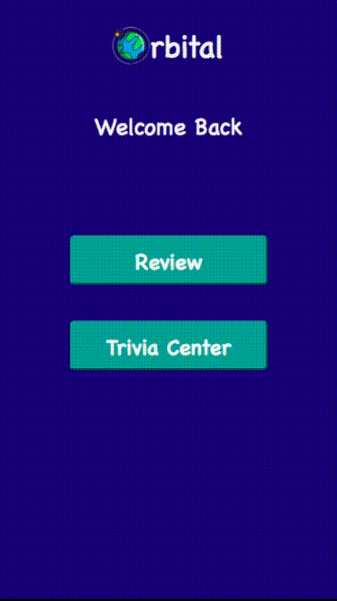

# Orbital

#### By <a href="https://github.com/kmiller9393">Kurt Miller</a>

### Project Description

Orbital is a mobile-first application that utilizes data from Hubblesite's API with the goal of helping educate high school students about the universe. There is a Review section where students can study a variety of glossary terms and when they are ready, they can move into the Trivia section to test their space knowledge. This application was built using React, Redux, Sass for styling and Jest for testing.

#### Getting Started

### [View Deployed Application Here](https://orbital-app.herokuapp.com/)

1. Clone this repository to your local machine.

2. `npm install`.

3. `npm start`.

### User Interface

#### Landing Page

#### Review Page

#### Trivia Page

#### Current Events Page

